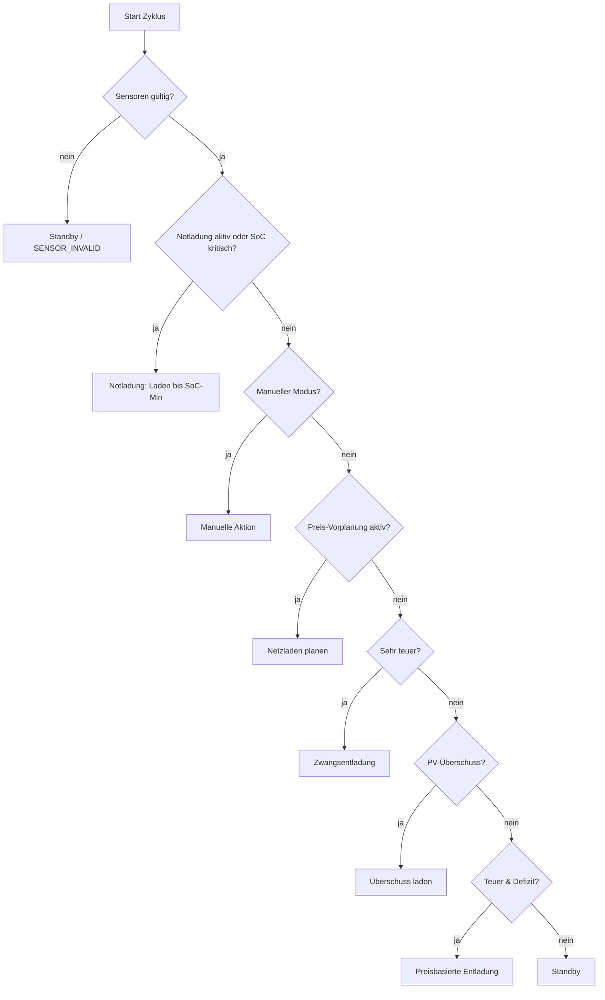
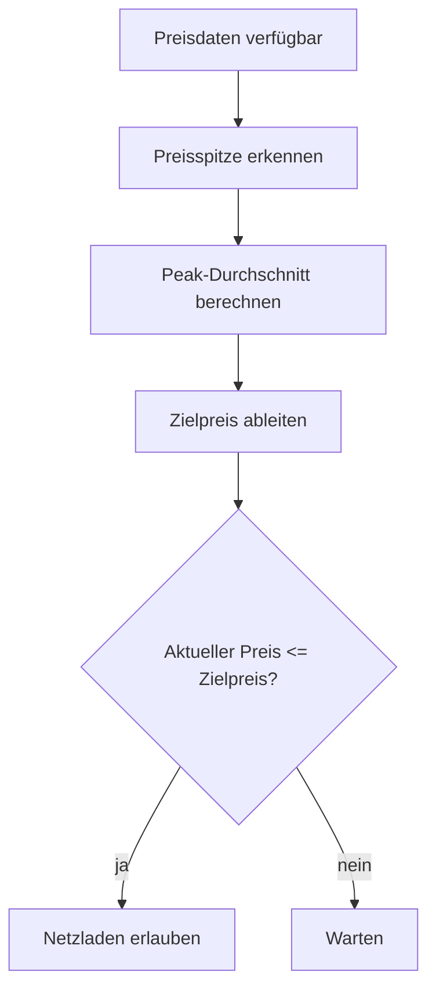
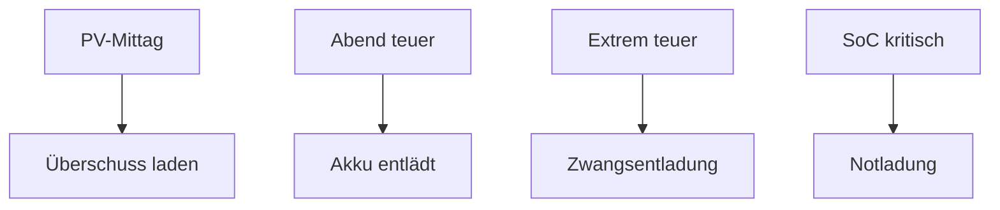

# Zendure SmartFlow AI – Anleitung  
Version: 1.2.1  
Stand: 06.01.2026  

> Diese Anleitung erklärt **nicht nur was** die Integration tut, sondern vor allem **wie und warum** die KI entscheidet.  
> Ziel: Du sollst jederzeit nachvollziehen können, **warum** gerade geladen / entladen / Standby ist – und wie du das Verhalten über die GUI steuerst.

---

## Inhaltsverzeichnis

1. Überblick: Was macht die KI wirklich?
2. Datenquellen: Welche Sensoren werden gelesen?
3. Zustände & Begriffe: SoC, Hauslast, Defizit, Überschuss
4. Entscheidungs-Engine: Prioritäten & Reihenfolge
5. Notladung: Trigger, Persistenz, Ende bei SoC-Min
6. Betriebsmodi im Detail
7. Manuelle Aktion
8. Preislogik & Preis-Vorplanung
9. PV-Überschuss-Laden
10. Entladen zur Defizitdeckung
11. Leistungs-Limits
12. Extrem teure Strompreise (Very Expensive)
13. Zendure-Ansteuerung
14. Transparenz & Debugging
15. Entscheidungsgrund (decision_reason)
16. Typische Szenarien
17. Häufige Stolperfallen
18. Zusammenfassung

---

## 1) Überblick: Was macht die KI wirklich?

Die Integration läuft zyklisch (Update-Intervall) und erzeugt in jedem Zyklus eine **vollständige Steuerentscheidung**:

- AC-Modus (Laden oder Entladen)
- Ladeleistung (Input Limit)
- Entladeleistung (Output Limit)

Die Entscheidung basiert auf:

- Akku-SoC
- PV-Leistung
- Hauslast
- Netzdefizit / Einspeisung
- Strompreis (optional, jetzt & Zukunft)
- GUI-Einstellungen
- interner Persistenz (Notladung, Preisplanung)

Die KI ist **deterministisch**:
> Gleiche Situation → gleiche Entscheidung.

---

## 2) Datenquellen

### Pflicht
- SoC-Sensor (%)
- PV-Leistung (W)

### Optional
- Strompreis Jetzt
- Preis-Export-Entität (z. B. Tibber)
- Grid-Daten (Single oder Split)

### Zendure-Steuerung
- AC Mode (Select)
- Input Limit (Number)
- Output Limit (Number)

---

## 3) Zustände & Begriffe

### Hauslast
Hauslast ist der **Gesamtverbrauch des Hauses**:

- Eigenverbrauch aus PV
- plus Netzbezug

Berechnung:

- Grid Mode SINGLE  
  `house_load = pv + grid_power`

- Grid Mode SPLIT  
  `house_load = pv + grid_import - grid_export`

---

## 4) Entscheidungs-Engine: Prioritäten & Reihenfolge

Die KI arbeitet **streng prioritätsbasiert**.

Reihenfolge:

1. Notladung (Safety, verriegelt)
2. Manueller Modus
3. Preis-Vorplanung (Netzladen)
4. Sehr teurer Strom (Zwangsentladung)
5. PV-Überschuss-Laden
6. Preisbasierte Entladung
7. Standby

Wichtig:
- Niedrigere Regeln können höhere **niemals** überschreiben.

---

## 5) Notladung (Safety)

### Trigger
- SoC ≤ „Notladung ab SoC“

### Verhalten
- Notladung wird **persistent verriegelt**
- Laden bis **SoC-Minimum**
- Entladen immer 0 W

Die Notladung endet **erst**, wenn:
- SoC ≥ SoC-Minimum

---

## 6) Betriebsmodi

### Automatik
- PV-Überschuss laden
- Preis-Vorplanung aktiv
- Entladen bei teurem Strom
- Sehr-teuer hat absolute Priorität

### Sommer
- Fokus Autarkie
- Entladen nur bei sehr teuer

### Winter
- Fokus Kostenersparnis
- Entladen bereits bei teuer

### Manuell
- KI vollständig deaktiviert
- Nur manuelle Aktion gilt

---

## 7) Manuelle Aktion

### Standby
- Laden 0 W
- Entladen 0 W

### Laden
- Laden mit Max. Ladeleistung
- Preis & PV egal

### Entladen
- Entladung deckt Defizit
- sonst Max. Entladeleistung

---

## 8) Preislogik & Preis-Vorplanung

### Schwellen
- Teuer
- Sehr teuer

### Preis-Vorplanung
- Analyse kommender Preise
- Erkennung von Preisspitzen
- gezieltes Netzladen vor Peaks

---

## 9) PV-Überschuss-Laden

Voraussetzungen:
- Hauslast berechenbar
- Überschuss > ~50 W
- SoC < SoC-Max

Ladeleistung:
- Minimum aus Überschuss und Max. Ladeleistung

---

## 10) Entladen zur Defizitdeckung

Defizit liegt vor, wenn:
- Hauslast > PV
- oder Netzimport gemessen wird

Entladung:
- Minimum aus Defizit und Max. Entladeleistung

---

## 11) Leistungs-Limits

### Max. Ladeleistung
- PV-Laden
- Netzladen
- Notladung

### Max. Entladeleistung
- Normalbetrieb
- Teuer-Entladung
- Manuell

---

## 12) Extrem teure Strompreise (Very Expensive)

Wenn:
- Preis ≥ Sehr-teuer-Schwelle

Dann:
- Entladung immer
- Modusunabhängig
- Ziel: Netzbezug = 0

Besonderheit:
- Max. Entladeleistung wird **temporär ignoriert**
- Begrenzung nur durch Hardware (~2400 W)

---

## 13) Zendure-Ansteuerung

Pro Zyklus werden gesetzt:
- AC-Modus
- Input-Limit
- Output-Limit

Grundregel:
- Laden → Entladen = 0
- Entladen → Laden = 0

---

## 14) Transparenz & Debugging

Sensoren:
- KI-Status
- Empfehlung
- Entscheidungsgrund
- Hauslast
- Preis
- Ø Ladepreis
- Gewinn

Alle Zwischenwerte stehen im `details`-Attribut.

---

## 15) Entscheidungsgrund (decision_reason)

Der Sensor zeigt **exakt**, welche Regel gegriffen hat.

Beispiele:
- `emergency_latched_charge`
- `pv_surplus_charge`
- `very_expensive_force_discharge_unlimited`
- `expensive_discharge`
- `standby_no_condition_met`

---

## 16) Typische Szenarien

---

## 17) Häufige Stolperfallen

- Falscher Grid-Modus
- Leere Preisquelle
- Erwartung: Dauerentladung
- Notladung endet nicht bei „Notladung ab SoC“

---

## 18) Zusammenfassung

Die KI ist:
- deterministisch
- prioritätsbasiert
- sicher
- erklärbar

Jede Entscheidung ist nachvollziehbar.
