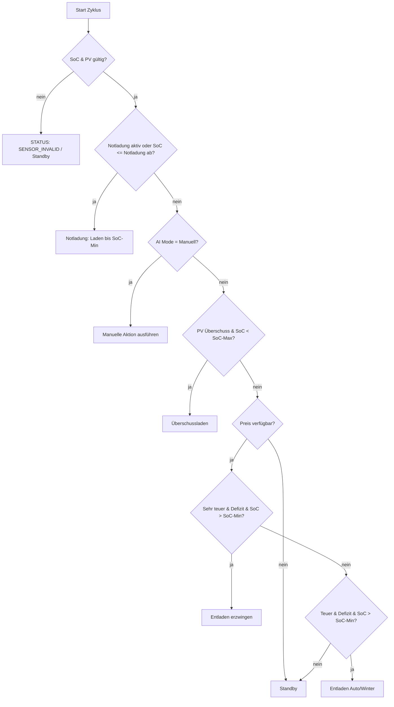

# Zendure SmartFlow AI – Anleitung
Version: 1.0.0  
Stand: 30.12.2025

> Diese Anleitung erklärt **nicht nur was** die Integration tut, sondern vor allem **wie und warum** die KI entscheidet.
> Ziel: Du sollst jederzeit nachvollziehen können, **warum** gerade geladen / entladen / Standby ist – und wie du das Verhalten über die GUI steuerst.

---

## Inhaltsverzeichnis

1. Überblick: Was macht die KI wirklich?
2. Datenquellen: Welche Sensoren werden gelesen?
3. Zustände & Begriffe: SoC, Hauslast, Defizit, Überschuss
4. Entscheidungs-Engine: Reihenfolge der Regeln
5. Notladung: Trigger, Persistenz, Ende bei SoC-Min
6. Modis im Detail (Automatik / Sommer / Winter / Manuell)
7. Manuelle Aktion: Was passiert konkret?
8. Preislogik: Teuer vs. Sehr-Teuer & warum Gewinnmarge (zukünftig)
9. PV-Überschuss-Laden: Wie die Leistung berechnet wird
10. Entladen zur Defizitdeckung: Warum, wann und wie stark?
11. Max-Limits: Wie die Regler die Steuerung begrenzen
12. Zendure-Ansteuerung: Welche Services werden gesetzt?
13. Debugging & Transparenz: Status, Empfehlung & Entscheidungsgrund
14. Entscheidungsgrund (decision_reason) – Bedeutung & Referenz
15. Sensoren & Attribute im Detail (Referenz)
16. Typische Szenarien (mit Erklärungen „warum gerade so“)
17. Häufige Stolperfallen & Troubleshooting
18. FAQ
19. Roadmap / Zukunft (optional)

---

## 1) Überblick: Was macht die KI wirklich?

Die Integration läuft zyklisch (Update-Intervall) und erzeugt in jedem Zyklus eine Entscheidung:

- **Betriebszustand** (AC-Mode): Laden oder Entladen
- **Input-Limit**: wie stark geladen werden soll (W)
- **Output-Limit**: wie stark entladen werden soll (W)

Die Entscheidung basiert auf:

- Akku-SoC (Ladezustand in %)
- PV-Leistung (W)
- Netzwerte (Import/Export oder Grid-Power)
- Strompreis (optional)
- GUI-Einstellungen (deine Regler & Selects)
- interner Persistenz (z. B. Notladung aktiv)

**Wichtig:**
Die KI ist **regelbasiert** (deterministisch).  
Das ist Absicht: gleiche Situation → gleiche Entscheidung.

---

## 2) Datenquellen: Welche Sensoren werden gelesen?

### Pflicht-Sensoren (aus der Konfiguration)
- **SoC Sensor**: aktueller Akku-Ladezustand in %
- **PV Sensor**: PV-Leistung in W

### Optional (je nach Konfiguration)
- **Strompreis Jetzt** (direkter Preis-Sensor)
- **Preis-Export Entität** (z. B. Tibber/Tarifdaten als Liste)
- **Grid Mode / Netzdaten**:
  - Single: **Grid Power** (positiv=Bezug, negativ=Einspeisung)
  - Split: **Grid Import** und **Grid Export**

### Zendure-Steuerentitäten (aus der Konfiguration)
- **AC Mode Select** (Input/Output)
- **Input Limit Number** (W)
- **Output Limit Number** (W)

---

## 3) Zustände & Begriffe (wichtig fürs Verständnis)

### SoC
- `soc`: aktueller Ladezustand des Akkus (%)

### SoC-Min / SoC-Max (GUI)
- `soc_min`: unter diese Grenze wird **nicht** aktiv entladen (Schutz)
- `soc_max`: darüber wird **nicht** geladen (Schutz)

### Hauslast (W)
Hauslast ist der geschätzte aktuelle Strombedarf im Haus.

Je nach Grid-Modus wird sie berechnet:

#### Grid Mode: SINGLE
- Du hast eine Entität „grid_power“:  
  - Bezug = positiv  
  - Einspeisung = negativ  
- Formel:
  - `house_load = pv + grid_power`

#### Grid Mode: SPLIT
- Du hast getrennte Werte:
  - `grid_import` (W)
  - `grid_export` (W)
- Formel:
  - `house_load = pv + grid_import - grid_export`

#### Grid Mode: NONE
- Hauslast kann nicht berechnet werden → PV-Überschusslogik ist eingeschränkt.

---

## 4) Entscheidungs-Engine: Reihenfolge der Regeln (das Herzstück)

Die KI entscheidet nach festen Prioritäten.
Man kann sich das wie eine Checkliste vorstellen:

1) **Notladung (Safety)**  
2) **Manueller Modus** (wenn aktiv)  
3) **PV-Überschuss-Laden** (wenn möglich)  
4) **Preisbasierte Entladung** (wenn Preis verfügbar)  
5) **Standby**

Ablaufdiagramm:

 
---

## 5) Notladung (Safety): Trigger, Persistenz und Ende bei SoC-Min

### Zweck der Notladung
Die Notladung ist eine **reine Sicherheitsfunktion**.  
Sie verhindert, dass der Akku zu tief entladen wird und stellt sicher, dass ein Mindest-SoC wiederhergestellt wird.

### Auslöser (Trigger)
Die Notladung wird aktiviert, sobald gilt:

- Aktueller SoC ≤ **Notladung ab SoC**

Dieser Wert wird über den GUI-Regler **„Notladung ab SoC“** definiert.

### Persistenz der Notladung (sehr wichtig)
Sobald die Notladung einmal ausgelöst wurde, wird sie **persistent gespeichert**.

Das bedeutet:
- Kleine Schwankungen im SoC führen **nicht** dazu, dass die Notladung ständig ein- und ausschaltet.
- Die Notladung bleibt aktiv, bis das definierte Ziel erreicht ist.

Intern wird dafür ein Flag gespeichert:
- `emergency_active = true`

### Ziel der Notladung
Die Notladung endet **nicht** bei „Notladung ab SoC“,  
sondern erst bei:

- Aktueller SoC ≥ **SoC Minimum**

Damit wird sichergestellt, dass der Akku nach einer kritischen Entladung wieder stabil oberhalb des Mindestwertes liegt.

### Leistung während der Notladung
Die Ladeleistung wird begrenzt durch:
- **Notladeleistung**
- **Max. Ladeleistung**

Es gilt immer:
- Tatsächliche Ladeleistung = Minimum aus beiden Werten

Während der Notladung gilt:
- Laden aktiv
- Entladen immer 0 W

---

## 6) Betriebsmodi im Detail

### 6.1 Automatik
Der Automatik-Modus kombiniert mehrere Strategien:

- Nutzung von PV-Überschuss zum Laden
- Preisbasierte Entladung bei teurem Strom
- Berücksichtigung von SoC-Min und SoC-Max

Typisches Verhalten:
- Tagsüber: Laden bei PV-Überschuss
- Abends: Entladen bei hohem Strompreis und Netzbezug

### 6.2 Sommer
Der Sommermodus ist **PV-orientiert**:

- Laden bei PV-Überschuss
- Entladen **nur**, wenn der Strompreis als „sehr teuer“ eingestuft wird

Normale „teuer“-Phasen führen im Sommer **nicht** zur Entladung.

### 6.3 Winter
Der Wintermodus ist **preisorientiert**:

- Entladen bereits bei „teuer“, sofern ein Defizit besteht
- PV-Überschuss wird weiterhin zum Laden genutzt

Geeignet für Zeiten mit wenig PV-Ertrag.

### 6.4 Manuell
Im manuellen Modus werden **alle automatischen Entscheidungen deaktiviert**.

Es gilt ausschließlich die Einstellung **„Manuelle Aktion“**.

---

## 7) Manuelle Aktion – exaktes Verhalten

### Standby
- AC-Modus: Laden
- Ladeleistung: 0 W
- Entladeleistung: 0 W

Der Akku bleibt vollständig neutral.

### Laden
- AC-Modus: Laden
- Ladeleistung: Max. Ladeleistung
- Entladen: 0 W

Preis, PV oder Defizit spielen keine Rolle.

### Entladen
- AC-Modus: Entladen
- Ladeleistung: 0 W
- Entladeleistung:
  - Wenn Netzdefizit bekannt: Deckung des Defizits
  - Andernfalls: Max. Entladeleistung

Ein künstliches 50 %-Limit existiert **nicht**.

---

## 8) Preislogik: „Teuer“ und „Sehr teuer“

### Preisquellen
Der aktuelle Strompreis kann stammen aus:
- einem direkten Preissensor
- einer Preisliste (z. B. Tibber-Exportdaten)

### Schwellenwerte
Über die GUI einstellbar:
- **Teuer-Schwelle**
- **Sehr-Teuer-Schwelle**

### Entscheidungslogik
- Sehr teuer:
  - Entladung wird erzwungen, sofern SoC > SoC-Min und ein Defizit besteht
- Teuer:
  - Entladung nur im Automatik- oder Wintermodus
- Sommermodus:
  - Entladung nur bei „sehr teuer“

---

## 9) PV-Überschuss-Laden

### Voraussetzung
PV-Überschuss-Laden ist nur möglich, wenn die Hauslast berechnet werden kann.

### Berechnung
- Überschuss = PV-Leistung − Hauslast
- Überschuss < 0 wird ignoriert

### Verhalten
Wenn gilt:
- Überschuss > ca. 50 W
- SoC < SoC-Max

Dann:
- AC-Modus: Laden
- Ladeleistung = Minimum aus:
  - Überschuss
  - Max. Ladeleistung
- Entladen = 0 W

---

## 10) Entladen zur Defizitdeckung

### Defizit
Ein Defizit liegt vor, wenn:
- Hauslast > PV-Leistung  
oder
- Netzimport gemessen wird

### Verhalten
Bei Defizit und passender Preislage:
- AC-Modus: Entladen
- Entladeleistung = Minimum aus:
  - Defizit
  - Max. Entladeleistung
- Laden = 0 W

So wird der Netzbezug gezielt reduziert.

---

## 11) Wirkung der Leistungs-Limits

### Max. Ladeleistung
Begrenzt:
- PV-Laden
- Manuelles Laden
- Notladung

### Max. Entladeleistung
Begrenzt:
- Manuelles Entladen
- Preisbasierte Entladung
- Sehr-teuer-Entladung

Kein Szenario kann diese Limits überschreiten.

---

## 12) Ansteuerung des Zendure-Systems

Pro Regelzyklus werden aktiv gesetzt:
- AC-Modus (Laden oder Entladen)
- Ladeleistung
- Entladeleistung

Grundregel:
- Beim Laden ist Entladen immer 0 W
- Beim Entladen ist Laden immer 0 W

So werden alte Grenzwerte zuverlässig überschrieben.

---

## 13) Transparenz und Debugging

Alle Entscheidungen sind über Sensoren und Attribute nachvollziehbar.

Wichtige Sensoren:
- Systemstatus
- KI-Status
- Empfehlung
- Hauslast
- Aktueller Strompreis
- Ø Ladepreis
- Gewinn / Ersparnis

Zusätzlich enthalten die Sensoren ein **Details-Attribut** mit:
- SoC-Werten
- PV, Hauslast, Überschuss, Defizit
- Preiswerten und Schwellen
- gesetzten Lade- und Entladeleistungen
- Notladestatus

### Entscheidungsgrund (decision_reason)

Zusätzlich zu **KI-Status** und **Empfehlung** stellt die Integration
den Sensor **„Entscheidungsgrund“** bereit.

Dieser Sensor beantwortet explizit die Frage:

> **Warum hat die KI diese Entscheidung getroffen?**

Während:
- **KI-Status** beschreibt *den aktuellen Zustand*  
- **Empfehlung** beschreibt *die empfohlene Aktion*  

liefert **decision_reason** die **konkrete Regel**, die gegriffen hat.

Das ist besonders hilfreich für:
- Debugging
- Verständnis komplexer Situationen
- Support / Forum / Fehlersuche

Damit lässt sich jede Entscheidung rückverfolgen.

---

## 14) Entscheidungsgrund (decision_reason)

Der Sensor **decision_reason** zeigt den exakten Auslöser,
der im aktuellen Zyklus zur Entscheidung geführt hat.

Er ist **deterministisch**:
- Gleiche Situation → gleicher Entscheidungsgrund

### Mögliche Werte und ihre Bedeutung

#### idle
Keine Regel hat gegriffen.  
Die KI befindet sich im Standby.

---

#### emergency_latched_charge
Die **Notladung ist aktiv** und weiterhin gesperrt (Latch aktiv).  
Der Akku wird geladen, bis mindestens **SoC-Minimum** erreicht ist.

---

#### manual_mode
Der **manuelle Modus** ist aktiv.  
Automatische Regeln sind vollständig deaktiviert.

---

#### manual_charge
Manuelles Laden wurde explizit ausgewählt.

---

#### manual_discharge
Manuelles Entladen wurde explizit ausgewählt.

---

#### summer_cover_deficit
Sommermodus:
- Netzdefizit erkannt
- SoC > SoC-Minimum  
→ Akku deckt aktiv den Netzbezug (Autarkie-Fokus)

---

#### pv_surplus_charge
PV-Überschuss erkannt:
- PV-Leistung > Hauslast
- SoC < SoC-Maximum  
→ Akku wird mit Überschuss geladen

---

#### very_expensive_force_discharge
Sehr hoher Strompreis:
- Preis ≥ Sehr-Teuer-Schwelle
- Netzdefizit vorhanden
- SoC > SoC-Minimum  
→ Entladung wird **erzwungen**

---

#### expensive_discharge
Hoher Strompreis:
- Preis ≥ Teuer-Schwelle
- Netzdefizit vorhanden
- Automatik- oder Wintermodus aktiv  
→ Akku reduziert Netzbezug

---

#### standby_no_condition_met
Keine Bedingung erfüllt:
- kein Überschuss
- kein Defizit
- Preis nicht relevant  
→ Standby

---

## 15) Typische Szenarien

### Akku tief entladen
- SoC fällt unter Notladung ab SoC
- Notladung startet
- Lädt bis SoC-Minimum
- Automatik wird danach wieder freigegeben

### PV-Mittagsspitze
- PV größer als Hauslast
- Akku unter SoC-Max
- Überschussladen aktiv

### Abends hoher Strompreis
- Netzdefizit vorhanden
- Preis über Schwelle
- Entladung reduziert Netzbezug

---

## 16) Häufige Stolperfallen

- Falscher Grid-Modus → Hauslast falsch
- Preisquelle vorhanden, aber leer → Preisstatus ungültig
- Entladung stoppt korrekt bei SoC-Min
- Notladung endet **nicht** bei Notladung ab SoC

---

## 17) Zusammenfassung

Die KI arbeitet:
- deterministisch
- prioritätsbasiert
- sicherheitsorientiert

Jede Entscheidung ist:
- begrenzt
- nachvollziehbar
- über die GUI steuerbar

Damit ist jederzeit klar:
**Warum gerade geladen, entladen oder gewartet wird.**

---
